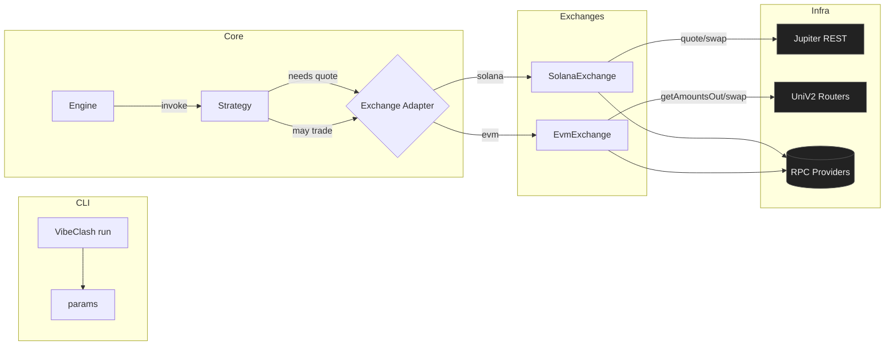
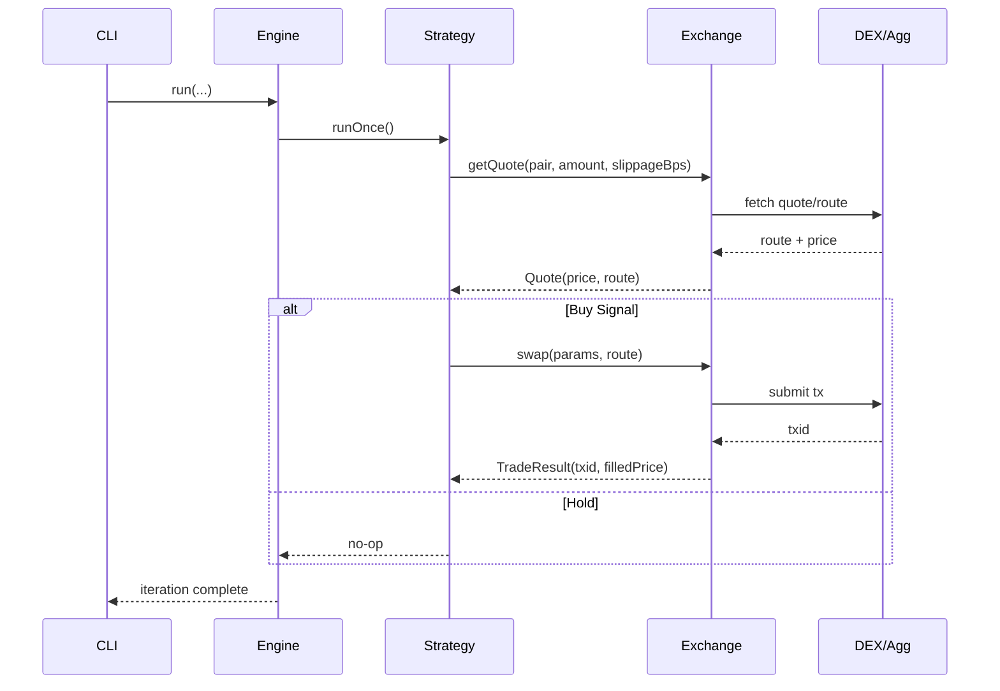
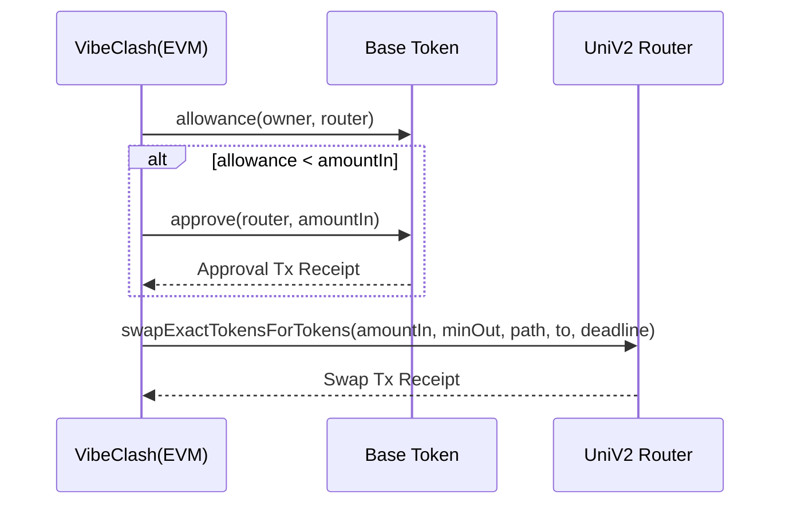
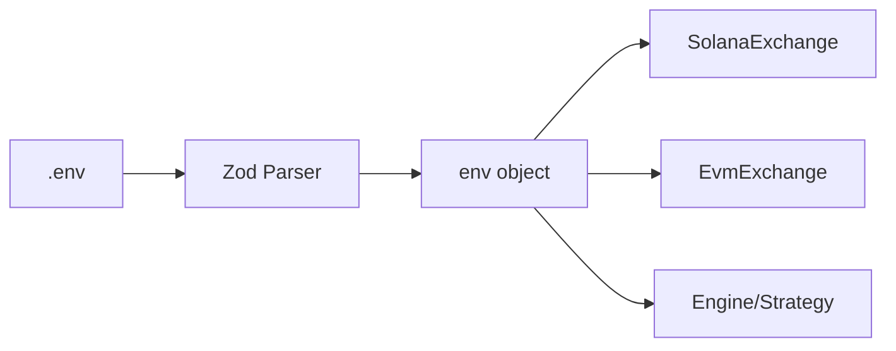
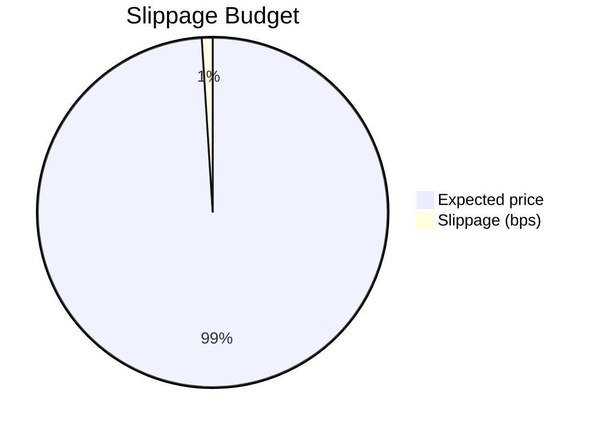
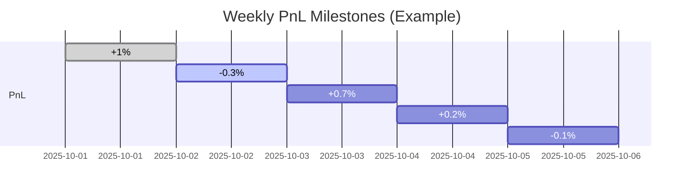

VibeClash — LIVE, Open Source, All‑in‑One Trading Agent
> Solana (Jupiter/Raydium) • Pump.fun (post‑migration) • BNB Chain (UniV2/Pancake) • Astar (UniV2) • Optional LLM policy

VibeClash is a modular trading agent designed for **real trading** (no paper mode). It provides a clean CLI, small but expressive strategy layer, exchange adapters for **Solana** and **EVM chains**, and an optional **LLM‑assisted policy**.

---


## TL;DR (LIVE)

```bash
npm i
cp .env.example .env
# Fill RPCs + keys (burners). MODE must be LIVE.

# BSC with LLM Strategy
export LLM_ENABLED=true && export OPENAI_API_KEY=sk-...
npm run dev -- run --network bsc --strategy llm --base WBNB --quote BUSD --amount 0.05

# Validate your LLM key quickly
npm run dev -- llm-test
```

---

## Highlights
- **Live‑only** execution with explicit key requirements
- **Pluggable LLM** decision policy (OpenAI / Anthropic / Deepseek)
- **Strategy engine** with tiny but realistic examples (SMA momentum; LLM policy)
- **DEX routing**: Jupiter on Solana, UniswapV2 routers on BSC/Astar (+ ERC20 approve path)
- **Clean TypeScript** repo, MIT license, Dockerfile

---

## Supported Networks

| Chain | Router/Aggregator | Swap Signing | Notes |
|------:|-------------------|--------------|-------||
| BNB Chain (BSC) | UniV2 / Pancake | EVM Private Key | Includes ERC20 allowance auto‑approve |
| Aster | UniV2 compatible | EVM Private Key | Router address configurable in `.env` |

> **Always verify** router addresses and keep slippage tight for new pools.

---

## Architecture (High‑Level)



---

## Trading Loop (Sequence)



---

## EVM Swap Path (Allowance + Swap)



---

## LLM Policy – Decision Graph

```mermaid
flowchart TD
  A[Fetch Quote & Context] --> B[Prompt LLM (BUY or HOLD)]
  B -->|BUY| C[Execute Swap (minOut w/ slippage)]
  B -->|HOLD| D[Skip Trade]
  C --> E[Log txid + price]
  D --> E[Log snapshot]
```

### Example System/User Prompt (built‑in)
```
System: "You are a cautious trading micro‑policy. Only answer with BUY or HOLD."
User: 
  Pair: SOL/USDC
  Price: 123.45678901
  Instruction: Reply with BUY if a small buy is reasonable now; otherwise reply with HOLD.
```

Enable with:
```env
LLM_ENABLED=true
LLM_PROVIDER=openai  # or anthropic | deepseek
OPENAI_API_KEY=...
```

---

## Strategy Interface (Build Your Own)

```ts
export interface IExchange {
  getQuote(p: TradeParams): Promise<Quote>;
  swap(p: TradeParams, route?: any): Promise<TradeResult>;
}

export interface TradeParams {
  base: TokenInfo;  // symbol/address/decimals
  quote: TokenInfo;
  amount: number;   // base amount
  slippageBps: number;
}
```

**Add a new strategy**
1. Create `src/strategies/myStrat.ts` that exposes `runOnce()`
2. Import & route it in `src/core/engine.ts`
3. Invoke via `--strategy myStrat`

---

## Config Graph (Where settings come from)



Key variables (`.env.example` includes all):
- `MODE=LIVE` (required)
- Solana: `SOLANA_RPC`, `SOLANA_KEYPAIR`, `JUPITER_BASE_URL`
- EVM: `BSC_RPC`, `ASTAR_RPC`, `EVM_PRIVATE_KEY`, `*_UNISWAPV2_ROUTER`
- LLM: `LLM_ENABLED`, `LLM_PROVIDER`, `OPENAI_API_KEY` / `ANTHROPIC_API_KEY` / `DEEPSEEK_API_KEY`

---

## Risk Controls (Simple Defaults)


- Default `SLIPPAGE_BPS=100` (1%); tune per pair liquidity.
- Prefer **tiny sizes** for new pools; scale only with observed depth.
- Use **burner wallets** and separate machines for ops.

---

## Example PnL Snapshot (Concept)
> Hook this to a candles API & your trade logs.



---

## Docker

```bash
docker build -t VibeClash .
docker run --rm -it --env-file .env VibeClash --help
```

---

## Development Checklist
- [ ] Fill `.env` with **LIVE** RPCs + keys (burners)
- [ ] Verify router addresses
- [ ] Start with small `--amount`
- [ ] Set `SLIPPAGE_BPS` conservatively
- [ ] (Optional) Turn on LLM policy and validate with `llm-test`

---

## FAQ

**Q: Does VibeClash support Pump.fun tokens?**  
A: Yes, **after migration** to Raydium (normal SPL pools). The watcher shows demo logs; wire a real feed to auto‑trigger strategies.

**Q: Why LIVE‑only?**  
A: This repo targets production‑like flows with explicit key handling and real tx paths. If you want paper trading, fork the earlier commit and re‑enable the simulators.

**Q: Can I add new chains?**  
A: Yes—add an adapter under `src/exchanges/`, implement `getQuote/swap`, extend token registries, and register in the CLI.

---

## Legal
MIT licensed. No warranties. You are responsible for your own keys, compliance, and risk management.
